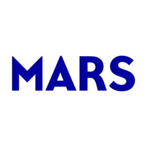
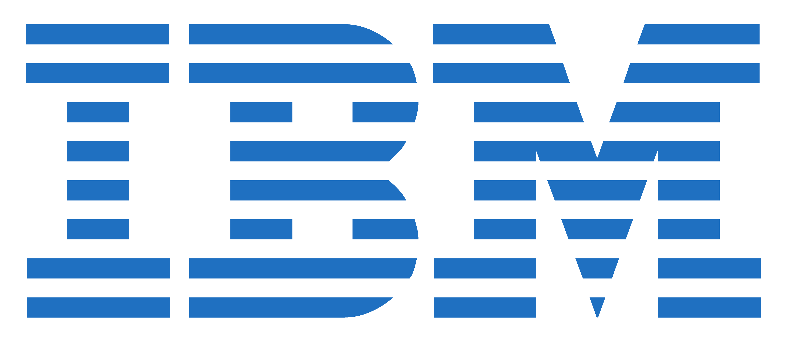
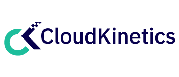
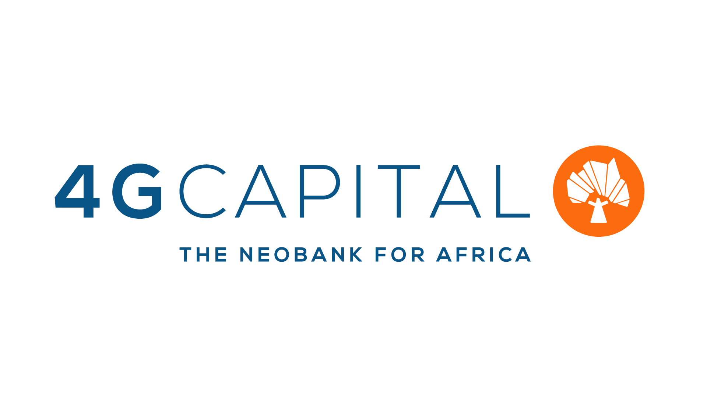
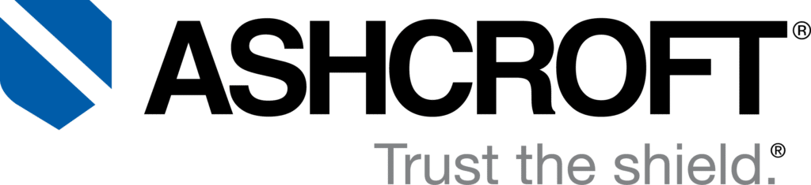
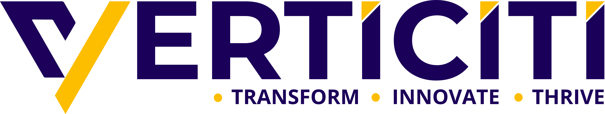

 

**We build production-grade AI systems — from voice agents that handle real phone calls to generative AI platforms processing millions of documents. Every product listed here is built in-house and deployed for real clients.**

 

 

> **All repositories listed below are private.** Source code is available to authorized clients and partners.
> Interested in a demo or access? **[Contact us](https://reallytics.ai/#contact)**

---

 

## Novalytics — AI Voice Assistant Suite

 

**Novalytics** is our AI calling agent platform — a suite of **10+ industry-specific voice assistants** that handle real inbound and outbound phone calls as intelligent receptionists. Each vertical has its own trained agent with domain knowledge, natural conversation flow, and backend integration.

These aren't chatbots pretending to talk. They handle live calls with **sub-300ms response latency** — fast enough that callers don't realize they're speaking with AI.

### What It Does

- Answers phone calls, understands context, and responds naturally in real-time
- Books appointments, manages schedules, and syncs with calendars
- Handles industry-specific queries (medical intake, financial advisory, hotel reservations)
- Transcribes, summarizes, and analyzes every call automatically
- Escalates to human agents when needed, with full conversation context

### Industry Verticals

Each vertical is a purpose-built voice agent for its specific domain:

| Vertical | What It Handles | Status |
|----------|----------------|--------|
| **Appointify** | Appointment scheduling with calendar integration |  |
| **EchoTrack** | Call tracking, transcription, and analytics |  |
| **Bookify** | Hotel reservations and guest services |  |
| **Remedi** | Medical receptionist — patient intake and clinical queries |  |
| **Nolan** | Financial services — account management and advisory |  |
| **Mindseed** | Educational assistant with adaptive learning |  |
| **Aeris** | Energy & utilities — compliance and customer service |  |
| **Calar** | Intelligent calendar management and scheduling |  |
| **Taskly** | Voice-activated task management and workflows |  |
| **Vault** | Secure document management for enterprise compliance |  |

<b>Repositories (20 private repos)</b>

 

| Repository | Type | Description |
|-----------|------|-------------|
| `Novalytics` | Web Platform | Main platform and dashboard |
| `Novalytics-Appointify` | Web Frontend | Appointify vertical interface |
| `Novalytics-EchoTrack` | Web Frontend | EchoTrack vertical interface |
| `Novalytics-Taskly` | Web Frontend | Taskly vertical interface |
| `Novalytics-Vault` | Web Frontend | Vault vertical interface |
| `Novalytics-Remedi` | Web Frontend | Remedi vertical interface |
| `Novalytics-Nolan` | Web Frontend | Nolan vertical interface |
| `Novalytics-Mindseed` | Web Frontend | Mindseed vertical interface |
| `Novalytics-Calar` | Web Frontend | Calar vertical interface |
| `Novalytics-Aeris` | Web Frontend | Aeris vertical interface |
| `voice-assistants` | Backend Core | Core voice assistant framework |
| `voice-assistants-bookify` | Backend | Bookify voice engine |
| `voice-assistants-echotrack` | Backend | EchoTrack voice engine |
| `voice-assistants-taskly` | Backend | Taskly voice engine |
| `voice-assistants-vault` | Backend | Vault voice engine |
| `voice-assistants-remidi` | Backend | Remedi voice engine |
| `voice-assistants-nolan` | Backend | Nolan voice engine |
| `voice-assistants-mindseed` | Backend | Mindseed voice engine |
| `voice-assistants-clara` | Backend | Clara voice engine |
| `voice-assistants-aeris` | Backend | Aeris voice engine |

---

 

## Generative AI Platform

 

Our **Generative AI platform** powers intelligent chatbots, document processing agents, and conversational AI systems across multiple industries. This isn't a wrapper around an API — it's a full production platform with retrieval-augmented generation, multi-tenant isolation, streaming responses, and enterprise-grade security.

### What It Does

- Industry-specific chatbots that understand domain context (finance, healthcare, retail, legal)
- Document ingestion, parsing, and intelligent Q&A over enterprise knowledge bases
- Agentic workflows that chain multiple AI capabilities to solve complex tasks
- Real-time streaming responses with conversation memory and context management
- Multi-tenant architecture — each client's data is completely isolated

### Deployed Products

| Product | What It Does | Status |
|---------|-------------|--------|
| **Knowledge-Driven Chatbots** | Industry-specific AI agents for customer support and internal knowledge |  |
| **Agentic AI Platform** | Document validation, RAG pipelines, and AI-driven decision support |  |
| **ConvoGeniQ** | Conversational AI with intelligent routing and context-aware dialogue |  |
| **NovaBots** | Multi-bot framework for deploying domain-specific assistants at scale |  |
| **Medical Speech-to-Speech** | Medical-grade real-time transcription and clinical note generation |  |
| **RealTalk** | Real-time voice communication platform |  |

<b>Repositories (8 private repos)</b>

 

| Repository | Description |
|-----------|-------------|
| `chatbot` | Production conversational AI engine (powers chatbots.reallytics.ai) |
| `Gen-AI-Reallytics` | Agentic AI platform (powers genai.reallytics.ai) |
| `GenAiChatbots` | Industry-specific chatbot variants |
| `Convogeniq` | Conversational AI with intelligent routing |
| `genai` | Core Gen AI toolkit and LLM orchestration |
| `NovaBots` | Multi-bot deployment framework |
| `Medical-Speech-to-Speech` | Medical speech-to-speech AI |
| `RealTalkAWS` | Real-time voice communication infrastructure |

---

 

## Data Analytics & Fraud Intelligence

 

Our **data analytics platform** combines traditional BI with AI — users ask questions about their data in plain English and receive interactive charts, statistical summaries, and actionable insights. The fraud detection system uses ensemble ML models to flag suspicious transactions in real-time.

### What It Does

- Natural language to visualization — ask a question, get a chart
- Real-time fraud detection scoring on financial transactions
- Investment analysis with time-series forecasting models
- Automated credit risk rating and scoring
- Interactive dashboards augmented with AI insights

### Deployed Products

| Product | What It Does | Status |
|---------|-------------|--------|
| **Data Analytics Platform** | LLM-powered dashboards with natural language queries |  |
| **Fraud Detection** | Real-time transaction fraud scoring and dashboards |  |
| **Investment Analysis** | Time-series forecasting and portfolio optimization |  |
| **AutoRiskRating** | ML-based credit risk assessment |  |
| **IntelliTrax** | Intelligent workflow tracking and process analytics |  |

<b>Repositories (6 private repos)</b>

 

| Repository | Description |
|-----------|-------------|
| `Data-Analytics-Platform` | LLM-powered analytics dashboard |
| `Fraud_Detection` | Real-time fraud detection system |
| `Investment-Analysis` | Time-series forecasting and portfolio optimization |
| `AutoRiskRating` | ML-based credit risk scoring |
| `Intellitrax_Workflow` | Workflow tracking and analytics |
| `SDAS_System` | Smart Data Analytics System |

---

 

## Agentic AI Solutions

 

Our **Agentic AI solutions** are purpose-built AI agents for specific industries and use cases. Each agent combines generative AI with domain expertise to automate complex workflows — from fraud investigation to clinical decision support to dental practice management.

These solutions were built as part of our Gen AI platform and are available as standalone deployments or integrated into existing client systems.

### Industry Agents

| Agent | Industry | What It Does |
|-------|----------|-------------|
| **Fraud Analyst** | Finance | Intelligent fraud pattern detection, investigation support, and risk assessment |
| **Archive Intelligence** | Enterprise | Document classification, extraction, and knowledge mining from large archives |
| **Clinical Workflows** | Healthcare | Patient flow optimization, resource allocation, and clinical documentation |
| **Nova Health** | Healthcare | Clinic management, patient scheduling, and clinical decision support |
| **Ask Dental** | Healthcare | Automated patient communication and clinical inquiry handling for dental practices |
| **Education AI** | Education | Interactive tutoring, assessment generation, and curriculum planning |
| **Utility Call Center** | Energy | Automated customer service, outage reporting, and billing for utility companies |
| **Shopping Assistant** | Retail | Dynamic product recommendations and personalized shopping journeys |

<b>Repositories (8 private repos)</b>

 

| Repository | Description |
|-----------|-------------|
| `Fraudulent-Assistant` | AI fraud analysis assistant |
| `Archive-Understanding` | Document archive analysis |
| `Optimized-Clinical-Workflows` | Clinical workflow automation |
| `Nova-Health-Clinic` | Health clinic management system |
| `Ask_Dental` | Dental practice AI assistant |
| `EducationUsecases` | AI education use cases |
| `AI-Powered-Utility_CallCenter` | Utility call center AI |
| `Personalized-Shopping-Experiences` | E-commerce recommendation engine |

---

 

## Enterprise Web Platforms

 

Production web applications serving real businesses — from document verification to project management to fashion tech.

### Flagship Products

<table>
<tr>
<td width="33%" valign="top">

### Verifi

**AI-Powered Document Verification**

Enterprise-grade identity verification, document validation, and regulatory compliance automation. Built for organizations that need reliable, automated verification workflows at scale.

- Automated document authenticity checks
- Identity verification workflows
- Regulatory compliance automation
- Audit trail and reporting

</td>
<td width="33%" valign="top">

### Tassync

**AI Task Synchronization**

Intelligent task routing, automated prioritization, and team workload balancing. Designed for teams managing complex, multi-stakeholder projects across distributed organizations.

- AI-powered task prioritization
- Cross-team workload balancing
- Automated progress tracking
- Smart deadline management
- Resource allocation insights

</td>
<td width="33%" valign="top">

### WearIt

**AI Fashion & Virtual Try-On**

Computer vision-powered fashion recommendation and virtual try-on platform. Style matching, body measurement estimation, and personalized outfit suggestions.

- Virtual try-on with body estimation
- AI-powered style recommendations
- Personalized outfit suggestions
- Fashion trend analysis

</td>
</tr>
</table>

### Other Live Platforms

| Platform | What It Does | Status |
|----------|-------------|--------|
| **CardboardPackage** | End-to-end packaging industry management — orders, inventory, quality control |  |
| **HeartPlace** | Healthcare patient management with ML-driven clinical insights |  |
| **Real-Talent** | AI talent management and intelligent recruiting |  |

<b>Repositories (8 private repos)</b>

 

| Repository | Description |
|-----------|-------------|
| `Verifi-by-SlacAi-NextJS` | Document verification platform |
| `Tassync` | Task synchronization platform |
| `wearit` | Fashion recommendation platform |
| `CardboardPackage_NextJS-Ver` | Packaging industry management |
| `HeartPlace` | Healthcare patient management |
| `Real-Talent` | Talent management platform |
| `Bookify-Hotel` | Hotel booking with AI concierge |
| `demo.reallytics` | Interactive demo platform |

---

 

## Industry AI Solutions

 

Purpose-built AI for regulated and high-stakes industries — where accuracy, compliance, and reliability are non-negotiable.

| Industry | Solution | What It Does |
|----------|---------|-------------|
| **Aerospace** | Defect Detection & Quality Assurance | Computer vision for automated visual inspection of aircraft components |
| **Aerospace** | Aero-Vision | Real-time visual quality assurance for aerospace manufacturing |
| **Manufacturing** | Predictive Maintenance | ML-driven equipment health monitoring and failure prediction |
| **Oil & Energy** | Equipment Monitoring | Predictive maintenance, safety compliance, and operational optimization |
| **Retail** | Store-Sight | Foot traffic analysis, shelf monitoring, and customer behavior insights |
| **Media** | Scene-Sense | Video and image analysis for content understanding and media intelligence |

<b>Repositories (6 private repos)</b>

 

| Repository | Description |
|-----------|-------------|
| `Aerospace` | Aerospace AI solutions |
| `Aero-Vision` | Computer vision for aerospace |
| `Manufacturing-Industrial` | Manufacturing predictive maintenance |
| `Oil-Energy-Gas` | Energy sector AI |
| `Store-Sight` | Retail analytics with computer vision |
| `Scene-Sense-Media-Understanding` | Multimodal media intelligence |

---

 

## AI Content Engine

 

Automated content pipelines for marketing, media, and creative teams — each running as a containerized microservice.

| Pipeline | What It Produces |
|----------|-----------------|
| **Product Ads** | AI-generated product photography, ad copy, and marketing materials |
| **Blog Engine** | SEO-optimized long-form articles with keyword research |
| **Image Studio** | High-quality AI image generation for commercial use |
| **Podcast Factory** | Script generation, voice synthesis, and audio production |
| **Creative Suite** | Brand-consistent marketing copy and visual content |
| **Game Assets** | Procedural game assets, NPC dialogue, and world-building content |

<b>Repositories (6 private repos)</b>

 

| Repository | Description |
|-----------|-------------|
| `Product-Ad-Generation` | Product ad creation |
| `BlogGeneration` | Blog content generation |
| `Image-Generation` | AI image generation |
| `Podcast` | Podcast production pipeline |
| `Creative-Content` | Marketing content generation |
| `Gaming` | Game asset generation |

---

 

## AI Customer Service

 

Automated customer service agents with ticket resolution, sentiment analysis, and intelligent escalation.

| Product | What It Does |
|---------|-------------|
| **CSR** | AI customer service representative with automated ticket resolution |
| **Advanced CSR** | Enhanced platform with sentiment analysis and predictive issue resolution |

<b>Repositories (3 private repos)</b>

 

| Repository | Description |
|-----------|-------------|
| `CSR` | AI customer service representative |
| `AICSR` | Advanced AI customer service |
| `CSR_Reallytics` | CSR platform variant |

---

 

## The Numbers

| | | |
|:---:|:---:|:---:|
| **90+** | **15** | **10+** |
| Private Repositories | Live Deployments | Industry Verticals |
| | | |
| **12+** | **<300ms** | **99.9%** |
| Enterprise Clients | Voice Agent Latency | Platform Uptime |

---

 

## Trusted By

<table>
<tr>
<td align="center" width="150"> <b>MARS Inc</b></td>
<td align="center" width="150"> <b>IBM</b></td>
<td align="center" width="150"> <b>Cloud Kinetics</b></td>
<td align="center" width="150"> <b>DataArt</b></td>
<td align="center" width="150"> <b>AWS Startups</b></td>
<td align="center" width="150"> <b>Silvertree Brands</b></td>
</tr>
<tr>
<td align="center" width="150"> <b>4G Capital</b></td>
<td align="center" width="150"> <b>Looper Insights UK</b></td>
<td align="center" width="150"> <b>Tower Loan</b></td>
<td align="center" width="150"> <b>Ashcroft</b></td>
<td align="center" width="150"> <b>Verticiti</b></td>
<td align="center" width="150"> <b>CXEX</b></td>
</tr>
</table>

---

 

## Want Access or a Demo?

All repositories are private. We provide access to authorized clients and partners.

 

Reallytics.ai — AI Engineering Studio — Connecting Elite AI Talent to the World

 

This showcase represents 90+ private repositories. Source code is proprietary and available under NDA.

